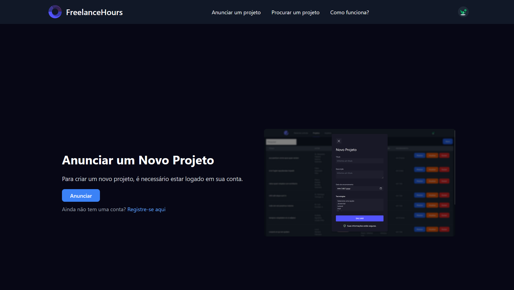
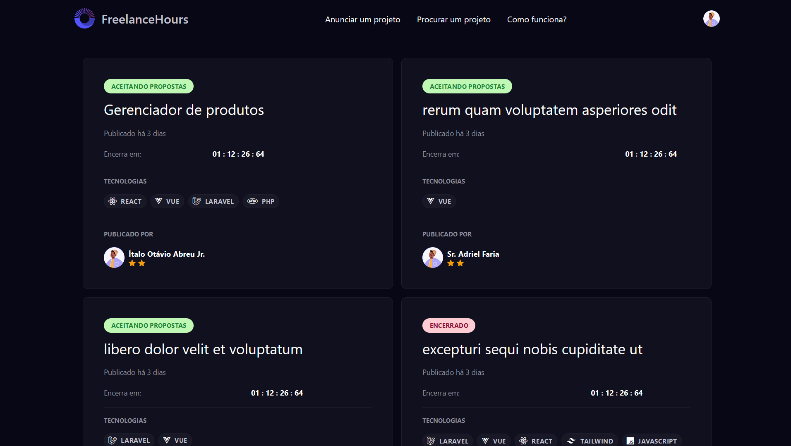
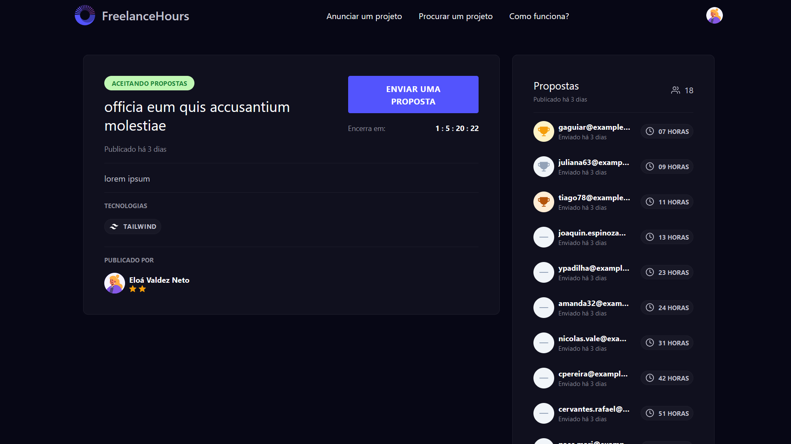
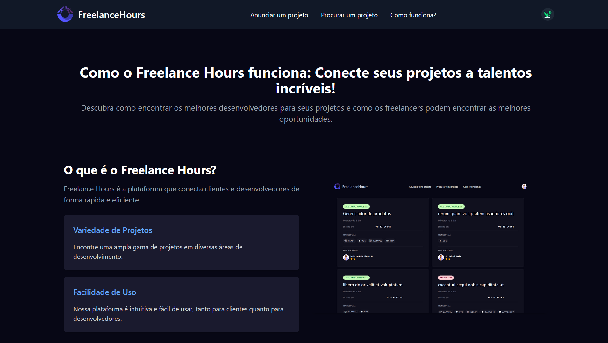
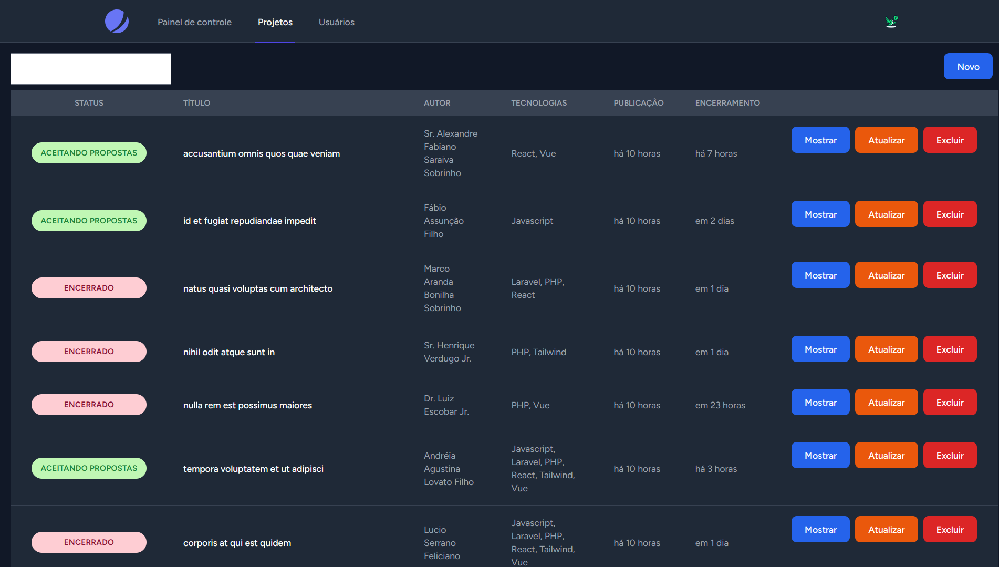
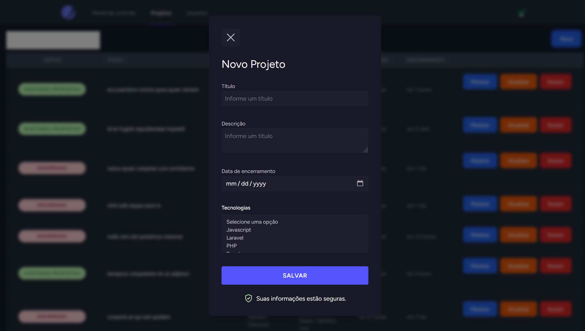
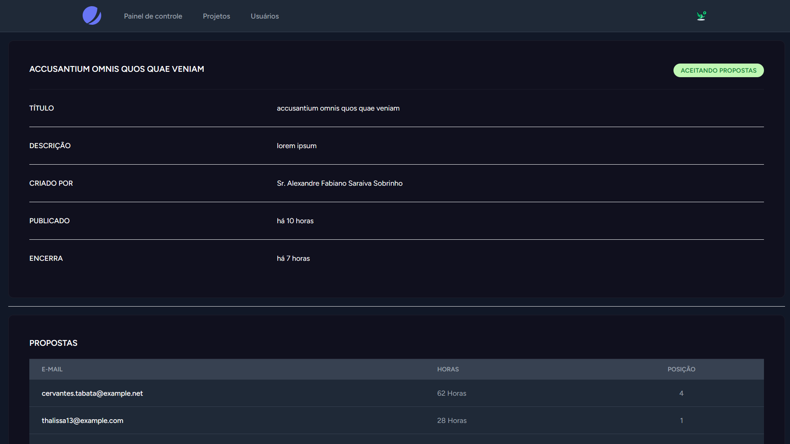
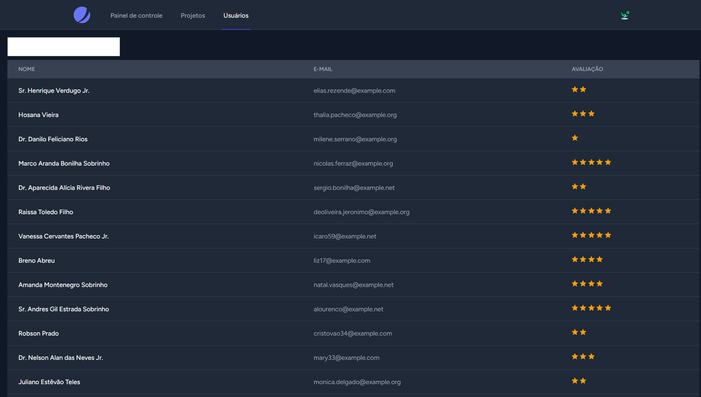

# NLW PHP
<p align="center">
  
    
</p>

## Descrição
FreelancerHours é uma plataforma web construída com PHP, Laravel e Livewire, que permite a freelancers oferecerem seus serviços de forma flexível. A plataforma facilita a criação de propostas personalizadas, nas quais os freelancers especificam o número de horas que podem dedicar a um determinado projeto, além de detalhar suas habilidades e experiência relevantes.

## Interfaces do site
<p align="left">
  
  
  
  
</p>

## Interfaces do sistema de gerenciamento
<p align="left">
  
  
  
  
</p>

## O que foi utilizado
Antes de começar a usar este projeto, é necessário ter o seguinte configurado em seu ambiente de desenvolvimento:

- PHP (versão 8.3 ou superior)
- Composer 2
- Laravel (versão 11.x)
- Banco de dados MySQL
- Docker e Docker-Compose

## Funcionalidades
- Enviando Propostas aos projetos
- Gerenciamento de Projetos
- Gerenciamento de Usuários
- Gerenciamento de Perfil

## Atividades
- [X]  - Fundamentos do PHP e do Laravel
- [X]  - Funcionalidades
- [X]  - Finalização da aplicação

## Instalação
Siga as etapas abaixo para configurar o projeto em seu ambiente local:

1. Clone este repositório para sua máquina local:
```
git clone https://github.com/RayconLima/lara-freelance-hours.git
```

2. Navegue até o diretório do projeto:
```
cd lara-freelance-hours
```

3. Copie o arquivo `.env` na raiz do projeto a partir do arquivo .env.example para configurar em seguida as informações do seu ambiente, incluindo as credenciais do banco de dados. 
```
cp .env .env.example
```
4. Inicie o servidor de desenvolvimento com os containers do docker. usando o comando pela primeira vez
```
docker-compose up -d
```

5. Acesse o container da aplicação laravel
```
docker-compose exec app bash
```

### Dentro do container
6. Instale as dependências do Composer com o comando:
```
composer install
```

5. Gere a chave de aplicativo Laravel:
```
php artisan key:generate
```

6. Execute as migrações do banco de dados para criar as tabelas necessárias:
```
php artisan migrate
```

7. Se necessário, execute os *seeders* para preencher o banco de dados com dados de exemplo:
```
php artisan db:seed
```

### Fora do container
8. Instale as dependências do node:
```
npm install
```

9. Iniciando o servidor de desenvolvimento para o Tailwind
```
npm run dev
```

## Entity Relationship Diagram
[DB Diagram](https://dbdiagram.io/d/freelancer_hours-67052bc6fb079c7ebdbd025e)